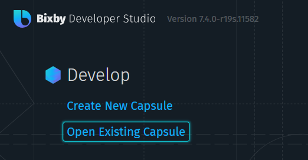

# :sparkles: 빅스비 캡슐 챌린지 시즌2 모각코 튜토리얼
> XXIT에서 운영하는 모각코를 위한 가이드 
> 빅스비 캡슐 챌린지 [안내 사이트]

## :pushpin: 접수하기

1. [Bixby Developer Center]에서 `이메일`로 회원가입합니다.

2. [참가 신청 사이트]에서 이벤트 등록을 합니다. 이메일은 1번에서 `가입한 이메일`로 기입합니다.

## :rocket: 캡슐 생성

1. [Bixby Developer Center]에서 자신의 OS에 맞는 `Bixby Developer Studio`를 설치합니다.

2. 간단한 예제 코드를 실행해보기 위해 [사칙연산 캡슐]을 로컬에 클론합니다.
3. `Bixby Developer Studio`에서 *Open Existing Capsule*을 클릭해 클론한 [사칙연산 캡슐] 폴더를 오픈합니다.

4. 왼쪽 사이드바에서 파일들을 확인할 수 있습니다.

5. 폰 모양의 아이콘을 클릭하거나 **Ctrl+7**(window)를 통해 `Simulator`를 실행합니다.

6. `Simulator`에서 다양한 테스트를 할 수 있습니다.

> - 해당 문서는 간단한 사용법을 설명하기 위함으로 세세한 기능들은 공식 홈페이지를 참고하기 바랍니다.
> - 추천 자료 : [Bixby 서비스 쉽게 개발해보기], [빅스비 캡슐 개발 Quick Start Guide], [SW Expert Academy 온라인 코스]

<!-- Link -->
[안내 사이트]: https://bixby.developer.samsung.com/newsroom/ko-kr/%EA%B3%B5%EC%A7%80-%E2%80%98%EB%B9%85%EC%8A%A4%EB%B9%84-%EC%BA%A1%EC%8A%90-%EC%B1%8C%EB%A6%B0%EC%A7%80-%EC%8B%9C%EC%A6%8C2-%EC%B0%B8%EA%B0%80-%EC%8B%A0%EC%B2%AD-%EC%A0%91%EC%88%98-%EC%8B%9C%EC%9E%91-%EB%8B%A4%EC%8B%9C-%EB%8F%84%EC%A0%84%ED%95%98%EC%84%B8%EC%9A%94
[Bixby Developer Center]: https://bixbydevelopers.com/
[참가 신청 사이트]: https://bixby.developer.samsung.com/events/ko-kr/%EC%BA%A1%EC%8A%90-%EC%B1%8C%EB%A6%B0%EC%A7%80-%EC%B0%B8%EA%B0%80-%EC%8B%A0%EC%B2%AD-%EC%A0%91%EC%88%98%ED%95%98%EA%B8%B0
[Bixby 서비스 쉽게 개발해보기]: https://bixby.developer.samsung.com/newsroom/ko-kr/튜토리얼-Bixby-서비스-쉽게-개발해보기
[빅스비 캡슐 개발 Quick Start Guide]: https://bixby.developer.samsung.com/newsroom/ko-kr/%EB%B9%85%EC%8A%A4%EB%B9%84%EC%BA%A1%EC%8A%90%EC%B1%8C%EB%A6%B0%EC%A7%80-%EC%8B%9C%EC%A6%8C2-%EB%B9%85%EC%8A%A4%EB%B9%84-%EC%BA%A1%EC%8A%90-%EA%B0%9C%EB%B0%9C-Quick-Start-Guide
[SW Expert Academy 온라인 코스]: https://swexpertacademy.com/main/learn/course/subjectList.do?courseId=BIXBY_CAPSULE
[사칙연산 캡슐]: https://github.com/bixbydevelopers/capsule-sample-arithmetic-KR